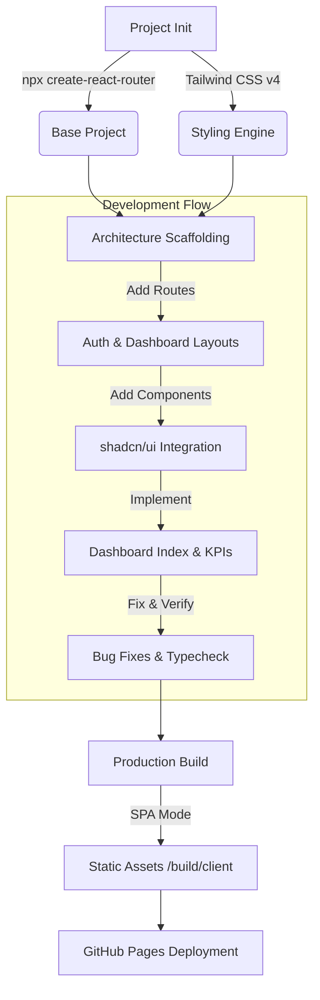

# Real Estate Dashboard

A modern, responsive Real Estate Dashboard built with **React Router v7**, **Tailwind CSS**, and **shadcn/ui**.

## 🚀 Features

-   **Dashboard Overview**: KPI cards and project data visualization.
-   **Property Management**: (Placeholder) Manage listings.
-   **Client Management**: (Placeholder) CRM features.
-   **Analytics**: (Placeholder) Visual data insights.
-   **Authentication**: Login page layout.
-   **Responsive Design**: Fully adaptable sidebar and layouts.

## 🛠️ Installation

### Prerequisites
-   Node.js (v18 or higher)
-   npm (v9 or higher)

### Quick Start

1.  **Clone and Install**
    ```bash
    git clone <repository-url>
    cd bex-tech-challenge
    npm install
    ```

    *Alternatively, run the setup script:*
    ```bash
    chmod +x setup.sh
    ./setup.sh
    ```

2.  **Run Development Server**
    ```bash
    npm run dev
    ```
    Open [http://localhost:5173](http://localhost:5173) to view the app.

3.  **Build for Production**
    ```bash
    npm run build
    ```
    The static files will be generated in the `build/client` directory, ready for GitHub Pages.

## 🏗️ Architecture & Build Process

The following diagram illustrates how the project was constructed and structured:



## 📁 Project Structure

-   `app/routes/`: File-based routing configuration.
-   `app/components/ui/`: Reusable shadcn/ui components.
-   `app/components/`: Layout-specific components (Sidebar, Nav).
-   `react-router.config.ts`: Configuration for SPA/Static mode.

## 🔧 Technologies

-   [React Router v7](https://reactrouter.com/)
-   [Tailwind CSS](https://tailwindcss.com/)
-   [shadcn/ui](https://ui.shadcn.com/)
-   [Vite](https://vitejs.dev/)

## 📸 Galería de Pruebas

A continuación se muestran capturas del proceso de desarrollo:


## 📝 Registro de Prompts

Para ver el detalle de cómo se utilizó la IA para construir este proyecto, consulta el [Registro de Prompts](PROMPTS_LOG.md).
